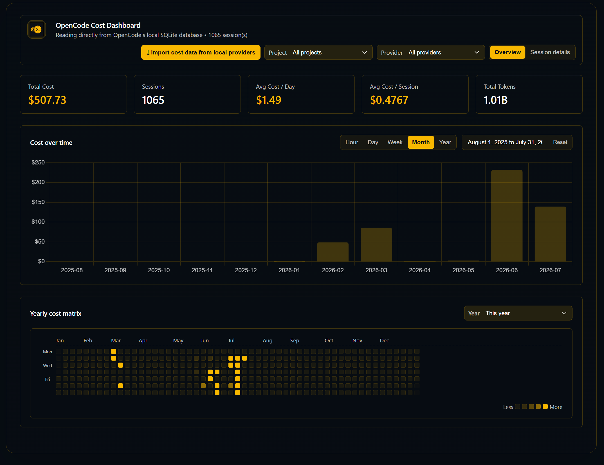

# OpenCode Cost Dashboard

A lightweight, open-source MCP server and local dashboard for inspecting coding-agent cost data from local databases. It is designed for use with any LLM IDE or MCP-capable client that can launch a local MCP server.



## What it shows

- Total cost, session count, and token usage
- Cost over time by hour/day/week/month/year
- Model-level cost breakdowns
- Session-level cost spikes and duration details
- Project-level aggregation

## Why this is useful

The dashboard helps you answer questions like:

- Which sessions cost the most?
- Which models are driving spend?
- How quickly did costs increase over time?
- Which project or workspace is the main source of usage?

## Installation

The simplest install path is to clone the repository and install its dependencies:

```bash
git clone https://github.com/silas-berg/opencode-cost-dashboard.git
cd opencode-cost-dashboard
npm install --no-fund --no-audit
```

Then start the local dashboard:

```bash
npm start
```

The dashboard is available at http://127.0.0.1:4795/.

## MCP setup

This repository includes an MCP server entrypoint in [mcp-server.mjs](mcp-server.mjs), so it can be added to any MCP-capable client such as OpenCode, Cursor, Claude Desktop, or other compatible IDEs.

Example MCP config:

```json
{
  "mcpServers": {
    "opencode-cost-dashboard": {
      "type": "stdio",
      "command": "node",
      "args": ["/absolute/path/to/opencode-cost-dashboard/mcp-server.mjs"]
    }
  }
}
```

A ready-to-copy example is also available in [examples/opencode-mcp-config.json](examples/opencode-mcp-config.json).

The MCP server exposes a tool named `opencode_cost_dashboard` with:

- start
- stop
- status

The dashboard auto-starts when the MCP server is launched, and the app runs locally without any remote syncing or telemetry.

## Importing cost from other providers

Use the Import cost data from local providers button in the top bar to pull usage from other coding-agent CLIs and merge it into the dashboard. A modal iterates through each provider and shows how many sessions were found, imported, and skipped as duplicates.

- Supported today: Claude Code, GitHub Copilot (CLI), Codex, Gemini CLI, and Cursor local history.
- GitHub Copilot (VS Code) is estimated from local OpenTelemetry token counts (dollar amounts are approximate, priced per model — see `COPILOT_PRICING` in [imports.mjs](imports.mjs)).
- Cursor imports local composer/session history from Cursor's SQLite state database. When Cursor has persisted token fields locally, those are used; otherwise the importer estimates tokens from the recovered text and marks the session as estimated.
- Extraction is delegated to [ccusage](https://github.com/ccusage/ccusage) via `npx` (offline pricing), so `node` and `npx` must be available. Cost is derived from token usage.
- Imports are idempotent: each session is keyed by `<provider>:<sessionId>`, so re-running never creates duplicates. Imported sessions are stored in a separate `cost-dashboard-imports.db`; your OpenCode database is never modified and remains read-only.

## Notes

- The dashboard reads local database data in read-only mode.
- No telemetry or remote syncing is required.
- It is intended to work on Linux, macOS, and Windows.
